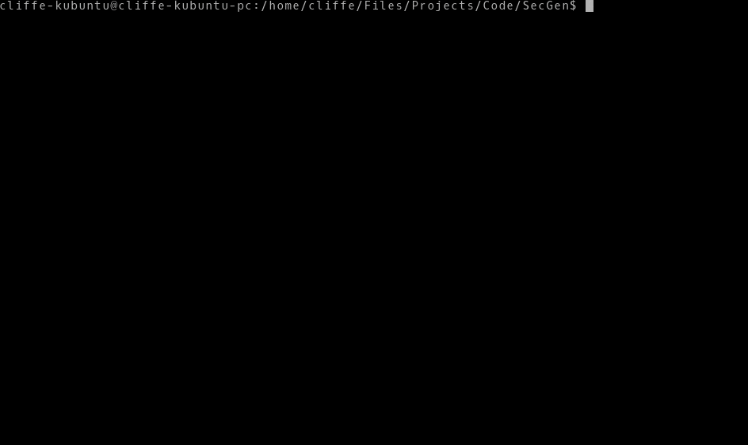
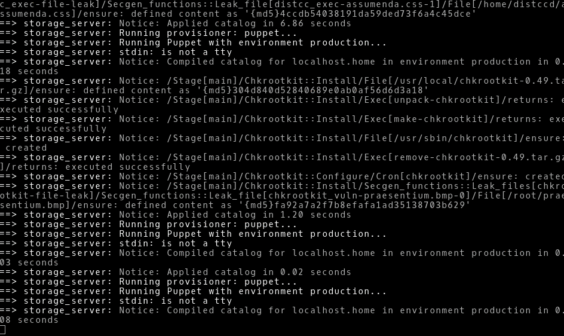
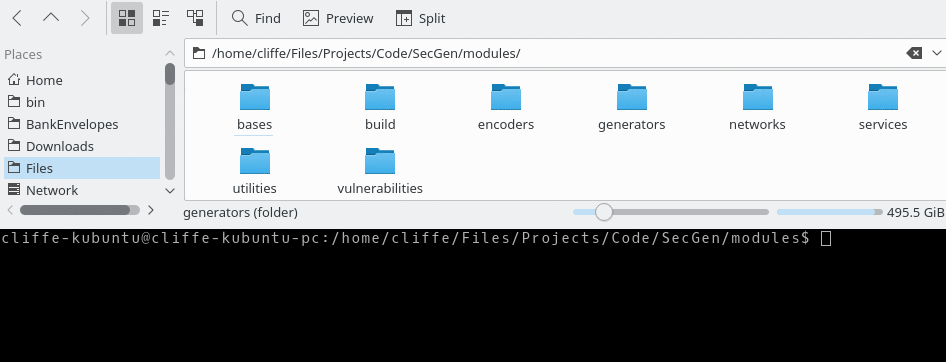
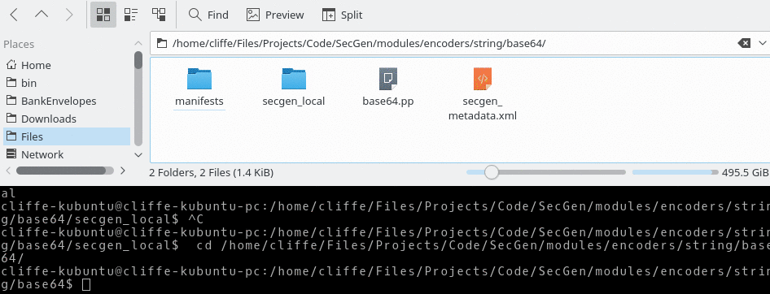

# Security Scenario Generator (SecGen)

## Summary
SecGen creates vulnerable virtual machines so students can learn security penetration testing techniques.

Boxes like Metasploitable2 are always the same, this project uses Vagrant, Puppet, and Ruby to create randomly vulnerable virtual machines that can be used for learning or for hosting CTF events.

[The latest version is available at: http://github.com/cliffe/SecGen/](http://github.com/cliffe/SecGen/)

## Introduction
Computer security students benefit from engaging in hacking challenges. Practical lab work and pre-configured hacking challenges are common practice both in security education and also as a pastime for security-minded individuals. Competitive hacking challenges, such as capture the flag (CTF) competitions have become a mainstay at industry conferences and are the focus of large online communities. Virtual machines (VMs) provide an effective way of sharing targets for hacking, and can be designed in order to test the skills of the attacker. Websites such as Vulnhub host pre-configured hacking challenge VMs and are a valuable resource for those learning and advancing their skills in computer security. However, developing these hacking challenges is time consuming, and once created, essentially static. That is, once the challenge has been "solved" there is no remaining challenge for the student, and if the challenge is created for a competition or assessment, the challenge cannot be reused without risking plagiarism, and collusion.

Security Scenario Generator (SecGen) generates randomised vulnerable systems. VMs are created based on a scenario specification, which describes the constraints and properties of the VMs to be created. For example, a scenario could specify the creation of a system with a remotely exploitable vulnerability that would result in user-level compromise, and a locally exploitable flaw that would result in root-level compromise. This would require the attacker to discover and exploit both randomly selected vulnerabilities in order to obtain root access to the system. Alternatively, the scenario that is defined can be more specific, specifying certain kinds of services (such as FTP or SMB) or even exact vulnerabilities (by CVE).

SecGen is a Ruby application, with an XML configuration language. SecGen reads its configuration, including the available vulnerabilities, services, networks, users, and content, reads the definition of the requested scenario, applies logic for randomising the scenario, and leverages Puppet and Vagrant to provision the required VMs.

## License
SecGen is free software: you can redistribute it and/or modify it under the terms of the GNU General Public License as published by the Free Software Foundation, either version 3 of the License, or (at your option) any later version.

SecGen contains modules, which install various software packages. Each SecGen module may contain or remotely source software, and each module defines its own license in the accompanying secgen_metadata.xml file.

## Installation
SecGen is developed and tested on Ubuntu Linux. In theory, SecGen should run on Mac or Windows, if you have all the required software installed.

You will need to install the following:
- Ruby (development): https://www.ruby-lang.org/en/
- Vagrant: http://www.vagrantup.com/
- Virtual Box: https://www.virtualbox.org/
- Puppet: http://puppet.com/
- Packer: https://www.packer.io/
- ImageMagick: https://www.imagemagick.org/
- And the required Ruby Gems (including Nokogiri and Librarian-puppet)

### On Ubuntu (16.04) these commands will get you up and running
Install all the required packages:
```bash
# install a recent version of vagrant
wget https://releases.hashicorp.com/vagrant/1.9.8/vagrant_1.9.8_x86_64.deb
sudo apt install ./vagrant_1.9.8_x86_64.deb
# install other required packages via repos
sudo apt-get install ruby-dev zlib1g-dev liblzma-dev build-essential patch virtualbox ruby-bundler imagemagick libmagickwand-dev exiftool libpq-dev libcurl4-openssl-dev libxml2-dev graphviz graphviz-dev
```

Copy SecGen to a directory of your choosing, such as */home/user/bin/SecGen*

Then install gems:
```bash
cd /home/user/bin/SecGen
bundle install
```

## Usage
Basic usage:
```bash
ruby secgen.rb run
```
This will use the default scenario to randomly generate VM(s).



SecGen accepts arguments to change the way that it behaves, the currently implemented arguments are:

```bash
   ruby secgen.rb [--options] <command>
      OPTIONS:
      --scenario [xml file], -s [xml file]: Set the scenario to use
                 (defaults to #{SCENARIO_XML})
      --project [output dir], -p [output dir]: Directory for the generated project
                 (output will default to projects/SecGen_DATEandTIME)
      --shutdown: Shutdown VMs after provisioning (vagrant halt)
      --network-ranges: Override network ranges within the scenario, use a comma-separated list
      --forensic-image-type [image type]: Forensic image format of generated image (raw, ewf)
      --read-options [conf path]: Reads options stored in file as arguments (see example.conf)
      --memory-per-vm: Allocate generated VMs memory in MB (e.g. --memory-per-vm 1024)
      --total-memory: Allocate total VM memory for the scenario, split evenly across all VMs.
      --cpu-cores: Number of virtual CPUs for generated VMs
      --help, -h: Shows this usage information
      --system, -y [system_name]: Only build this system_name from the scenario

      VIRTUALBOX OPTIONS:
      --gui-output, -g: Show the running VM (not headless)
      --nopae: Disable PAE support
      --hwvirtex: Enable HW virtex support
      --vtxvpid: Enable VTX support
      --max-cpu-usage [1-100]: Controls how much cpu time a virtual CPU can use
                               (e.g. 50 implies a single virtual CPU can use up to 50% of a single host CPU)

      OVIRT OPTIONS:
      --ovirtuser [ovirt_username]
      --ovirtpass [ovirt_password]
      --ovirt-url [ovirt_api_url]
      --ovirt-cluster [ovirt_cluster]
      --ovirt-network [ovirt_network_name]

      COMMANDS:
      run, r: Builds project and then builds the VMs
      build-project, p: Builds project (vagrant and puppet config), but does not build VMs
      build-vms, v: Builds VMs from a previously generated project
                 (use in combination with --project [dir])
      create-forensic-image: Builds forensic images from a previously generated project
                 (can be used in combination with --project [dir])
      list-scenarios: Lists all scenarios that can be used with the --scenario option
      list-projects: Lists all projects that can be used with the --project option
      delete-all-projects: Deletes all current projects in the projects directory

```

## Scenarios
SecGen generates VMs based on a scenario specification, which describes the constraints and properties of the VMs to be created.

### Using existing scenarios
Existing scenarios make SecGen's barrier for entry low: when invoking SecGen, a scenario can be specified as a command argument, and SecGen will then read the appropriate scenario definition and go about randomisation and VM generation. This removes the requirement for end users of the framework to understand SecGen's configuration specification.

Scenarios can be found in the scenarios/ directory. For example, to spin up a VM that has a random remotly exploitable vulnerability that results in user-level compromise:
```bash
   ruby secgen.rb --scenario scenarios/examples/remotely_exploitable_user_vulnerability.xml run
```


#### VMs for a security audit of an organisation
To generate a set of VMs for a randomly generated fictional organisation, with a desktop system, webserver, and intranet server:
```bash
   ruby secgen.rb --scenario scenarios/security_audit/team_project.xml run
```
Note that the intranet server has a security remit, with instructions on performing a security audit of these systems. The desktop system can access the intranet to access the remit, but the attacker VM (for example, Kali) can be connected to the NIC only shared by the Web server to simulate the need to pivot attacks through the Web server, as they can't connect to the intranet system directly. The "marking guide" is in the form of the output scenario.xml in the project directory, which provides the details of the systems generated.

#### VMs for a CTF event
To generate a set of VMs for a CTF competition:
```bash
   ruby secgen.rb --scenario scenarios/ctf/flawed_fortress_1.xml run
```
Note that a 'CTFd_importable.zip' file is also generated, containing all the flags and hints, which you can import into the [CTFd scoreboard frontend](https://github.com/CTFd/CTFd).

### Defining new scenarios
Writing your own scenarios enables you to define a VM or set of VMs with a configuration as specific or general as desired.

SecGen's scenario specification is a powerful interface for specifying the constraints of the vulnerable systems to generate. Scenarios are defined in XML configuration files that specify systems in terms of a base, services/utilities, vulnerabilities, and networks.

For details please see the **[Creating Scenarios guide](README-Creating-Scenarios.md)**.

## Modules
SecGen is designed to be easily extendable with modules that define vulnerabilities and other kinds of software, configuration, and content changes.

The types of modules supported in SecGen are:
 - base: a SecGen module that defines the OS platform (VM template) used to build the VM
 - vulnerability: a SecGen module that adds an insecure, hackable, state (including realistic software vulnerabilities known to be in the wild or fabricated hacking challenges)
 - service: a SecGen module that adds a (relatively secure) network service
 - utility: a SecGen module that adds (relatively secure) software or configuration changes
 - network: a virtual network card
 - generator: generates output, such as random text
 - encoder: receives input, such as text, performs operations on that to produce output (such as, encoding/encryption/selection)

Each vulnerability module is contained within the modules/vulnerabilies directory tree, which is organised to match the Metasploit Framework (MSF) modules directory structure. For example, the distcc_exec vulnerability module is contained within: modules/vulnerabilities/unix/misc/distcc_exec/.

The root of the module directory always contains a secgen_metadata.xml file and also contains puppet files, which are used to make a system vulnerable.

For details please see the **[Modules Metadata guide](README-Modules-Metadata.md)**.

### Generators and encoders create and alter content
Encoders and generators have code that is *evaluated at project build time*, such as encoding text, and generating flags and other potentially randomised content. In each case, this is a ruby script located within the module directory in **local/secgen_local.rb**. Although normally called by SecGen, secgen_local.rb scripts can be executed directly, and accept all the parameter inputs as command line arguments, and returns the output in JSON format to stdout. Other human readable output is written to stderr.

```bash
#ruby modules/encoders/string/base64/secgen_local/local.rb --strings_to_encode "encode this" --strings_to_encode "and this"
BASE64 Encoder
 Encoding '["encode this", "and this"]'
 Encoded: ["ZW5jb2RlIHRoaXM=", "YW5kIHRoaXM="]
["ZW5jb2RlIHRoaXM=","YW5kIHRoaXM="]
```



## Puppet is used to provision the VMs
Each vulnerability, service, and utility module contains Puppet files which are used to provision the software and configuration changes onto the VMs. By the time Puppet is executed to provision VMs, all randomisation has previously taken place at build time.

For details please see the **[Modules Puppet guide](README-Modules-Puppet.md)**.

## SecGen project output
By default output is to 'projects/SecGen_*[CurrentTime]*/'

The project output includes:
 - A Vagrant configuration for spinning up the boxes.
 - A directory containing all the required puppet modules for the above. A Librarian-Puppet file is created to manage modules, and some required modules may be obtained via PuppetForge, and therefore an Internet connection is required when building the project.
 - A de-randomised scenario XML file. Using SecGen you can use this 'scenario.xml' file to recreate the above Vagrant config and puppet files. Any randomisation that has been applied should be un-randomised in this output (compared to the original scenario file). This file contains all the details of the systems created, and can also be used later for grading, scoring, or giving hints.
 - A 'flag_hints.xml' file, containing all the flags along with multiple hints per flag.
 - A 'CTFd_importable.zip' file useful for CTF events, for import into the [CTFd scoreboard frontend](https://github.com/CTFd/CTFd).

If you start SecGen with the "build-project" (or "p") command it creates the above files and then stops. The "run" (or "r") command creates the project files then uses Vagrant to build the VM(s).

It is possible to copy the project directory to any compatible system with Vagrant, and simply run "vagrant up" to create the VMs.

The default root password for the base-boxes is 'puppet', but this may be modified by SecGen depending on the scenario used.

## Batch Processing with SecGen

Generating multiple VMs in a batch is now possible through the use of batch_secgen, which manages a job queue to mass-create VMs with SecGen. There are helper commands available to add jobs, list jobs in the table, remove jobs, and reset the status of jobs from 'running' or 'error' to 'todo'.  

For details please see the **[Batch Creation of VMs guide](README-Batch-VMs.md)**.

## Roadmap
- **More modules!** Including more CTF-style modules.
- Windows baseboxes and vulnerabilities.
- More security labs with worksheets.
- Further gamification and immersive scenarios.

## Acknowledgments
*Development team:*
- Dr Z. Cliffe Schreuders http://z.cliffe.schreuders.org
- Tom Shaw
- Jason Keighley
- Lewis Ardern -- author of the first proof-of-concept release of SecGen
- Connor Wilson

Many thanks to everyone who has contributed to the project. The above list is not complete or exhaustive, please refer to the [GitHub history](https://github.com/cliffe/SecGen/graphs/contributors).

This project is supported by a Higher Education Academy (HEA) learning and teaching in cyber security grant (2015-2017).
This project is supported by a Leeds Beckett University Teaching Excellence Fund grant (2018-2019).

## Contributing
We encourage contributions to the project.

Briefly, please fork from http://github.com/cliffe/SecGen/, create a branch, make and commit your changes, then create a pull request.

## Resources
Paper: [Z.C. Schreuders, T. Shaw, A. Mac Muireadhaigh, and P. Staniforth, “Hackerbot: Attacker Chatbots for Randomised and Interactive Security Labs, Using SecGen and oVirt,” USENIX Workshop on Advances in Security Education (ASE'18), Baltimore, MD, USA. USENIX Association, 2017.](https://www.usenix.org/conference/ase18/presentation/schreuders) (This paper describes Hackerbot and how we use SecGen with oVirt.)

Paper: [Z.C. Schreuders, T. Shaw, M. Shan-A-Khuda, G. Ravichandran, J. Keighley, and M. Ordean, “Security Scenario Generator (SecGen): A Framework for Generating Randomly Vulnerable Rich-scenario VMs for Learning Computer Security and Hosting CTF Events,” USENIX Workshop on Advances in Security Education (ASE'17), Vancouver, BC, Canada. USENIX Association, 2017.](https://www.usenix.org/conference/ase17/workshop-program/presentation/schreuders) (This paper provides a good overview of SecGen.)

Paper: [Z.C. Schreuders, and L. Ardern, "Generating randomised virtualised scenarios for ethical hacking and computer security education: SecGen implementation and deployment," in The first UK Workshop on Cybersecurity Training & Education (Vibrant Workshop 2015) Liverpool, UK, 2015.](http://z.cliffe.schreuders.org/publications/VibrantWorkshop2015%20-%20Generating%20randomised%20virtualised%20scenarios%20for%20ethical%20hacking%20and%20computer%20security%20education%20%28SecGen%29.pdf) (This paper describes the first prototype.)

Podcast interview: [Purple Squad Security Episode 011 – Security Scenario Generator with Dr. Z. Cliffe Schreuders](https://purplesquadsec.com/podcast/episode-011-security-scenario-generator-dr-z-cliffe-schreuders/)
